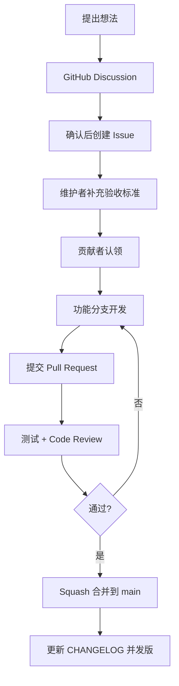

# 贡献指南（CONTRIBUTING）

感谢你对 **CV Python Vue TigerPro（Tiger AI Platform）** 的关注。

> **GitHub 是任务与决策的最终记录场所。**  
> 微信/飞书等即时通讯仅用于沟通加速，重要结论必须回写到 Discussion / Issue / PR。

仓库：https://github.com/5758703/CV_PythonVue_TigerPro  
许可证：[Apache License 2.0](./LICENSE)

---

## 1. 统一协作流程（必须遵循）

```text
提出想法
  ↓
GitHub Discussion 讨论
  ↓
确认需求后创建 Issue
  ↓
维护者补充验收标准
  ↓
贡献者认领 Issue
  ↓
创建功能分支
  ↓
提交 Pull Request
  ↓
自动测试＋代码评审
  ↓
按评审意见修改并通过
  ↓
Squash 合并到 main
  ↓
更新 CHANGELOG 并发布版本
```



> **GitHub 是任务与决策的最终记录场所。** 即时通讯仅作辅助。

### 流程细则

| 步骤 | 做什么 | 哪里做 |
|------|--------|--------|
| 想法 | 描述背景、目标、可选方案 | [Discussions](https://github.com/5758703/CV_PythonVue_TigerPro/discussions) |
| 需求确认 | 维护者或发起人创建 Issue | Issues（用模板） |
| 验收标准 | Maintainer / Module Owner 补全 | Issue 正文 |
| 认领 | 评论 `我来认领` / `/assign me` | Issue |
| 开发 | 从最新 `main` 拉分支 | 本地 Git |
| PR | 关联 Issue，写清自测 | Pull Requests |
| 合并 | **Squash and merge** 到 `main` | Maintainer |
| 发布 | 更新 `CHANGELOG.md`，打 tag | Maintainer |

**例外（可直接开 Issue，无需先 Discussion）：**

- 明确的 bug 复现
- 错别字 / 文档笔误
- 安全漏洞（**不要公开 Issue**，见 [SECURITY.md](./SECURITY.md)）

---

## 2. Issue 规范

### 2.1 每个 Issue 必须写清

1. **背景和目标**
2. **涉及模块**（backend / frontend / ai / devops / database 等）
3. **预期结果**
4. **验收标准**（可勾选清单）
5. **是否需要测试和文档**
6. **是否已有人员认领**（未认领写「无人认领」）

请使用仓库内 Issue 模板填写。

### 2.2 标签约定

**类型（必选其一）**

| 标签 | 含义 |
|------|------|
| `bug` | 缺陷 |
| `feature` | 新功能 |
| `enhancement` | 现有能力增强 |
| `docs` | 文档 |
| `refactor` | 重构（行为不变） |

**模块（可多选）**

| 标签 | 含义 |
|------|------|
| `backend` | Flask / 服务端 |
| `frontend` | Vue 前端 |
| `ai` | 推理、模型、训练、CV/语音等 |
| `devops` | 部署、CI、脚本、环境 |
| `database` | 表结构、迁移、种子数据 |

**状态**

| 标签 | 含义 |
|------|------|
| `needs-triage` | 待分诊 |
| `ready` | 可认领 |
| `in-progress` | 开发中 |
| `blocked` | 阻塞 |

**优先级**

`P0`（紧急） / `P1` / `P2` / `P3`（低）

**难度**

| 标签 | 含义 |
|------|------|
| `good-first-issue` | 新人友好 |
| `help-wanted` | 欢迎协助 |
| `advanced` | 需要较强领域经验 |

标签维护说明见 [`.github/LABELS.md`](./.github/LABELS.md)。可认领的新手任务见 [docs/community/good-first-issues.md](./docs/community/good-first-issues.md)。

---

## 3. 开发环境

### 3.1 前置

- Windows 10/11 或 Linux
- Python **3.12**（推荐；与 `backend/.venv` 一致）
- Node.js **18+**（推荐 20 LTS）
- MySQL 8.x
- Git

### 3.2 后端

```powershell
cd backend
# 推荐使用仓库脚本
powershell -ExecutionPolicy Bypass -File .\scripts\setup_venv.ps1
powershell -ExecutionPolicy Bypass -File .\scripts\run_backend.ps1
```

或手动：

```powershell
cd backend
python -m venv .venv
.\.venv\Scripts\Activate.ps1
pip install -r requirements.txt
copy .env.example .env   # 按需修改数据库等
python app.py            # 默认 http://127.0.0.1:5001
```

配置说明见 `backend/.env.example`、`backend/README.md`。

### 3.3 前端

```powershell
cd frontend
npm install
npm run dev              # 默认 http://127.0.0.1:5173，代理 /api → 5001
```

### 3.4 默认账号（本地种子）

| 账号 | 密码 | 说明 |
|------|------|------|
| `admin` | `admin123` | 超级管理员 |
| `tiger` | `123456` | 普通角色 |

**请勿**把生产密钥、真实 `.env`、模型权重目录提交进 Git。

---

## 4. 代码规范

### 4.1 通用

- 只改与 Issue 相关的文件；避免无关大重构
- 不提交：`.venv`、`node_modules`、`uploads/`、权重、密钥、本地 IDE 杂项
- 用户可见文案使用简体中文；代码标识符用英文
- 新增依赖需在 PR 中说明原因与许可证影响（见 [THIRD_PARTY_NOTICES.md](./THIRD_PARTY_NOTICES.md)）

### 4.2 后端（Python）

- 风格：尽量符合 PEP 8；公共函数补简短 docstring
- 路由保持现有蓝图与权限装饰器模式（`permission_required`）
- AI 推理优先复用 `backend/inference.py` 已有封装（如 `_get_model`），避免复制粘贴大段加载逻辑
- 异常：对用户返回明确 `message`；不要吞掉错误后静默成功
- 长耗时任务：沿用现有「异步 job + progress」模式

### 4.3 前端（Vue 3）

- Composition API + `<script setup>`
- 沿用 Element Plus 与现有页面布局/权限指令
- API 调用放在 `frontend/src/api/`；不要在视图里硬编码完整后端 URL
- 大文件改动请拆 PR 或先 Discussion

### 4.4 数据库

- 表结构变更需说明迁移步骤（SQL 或脚本）
- 种子数据改动保持幂等（参考 `backend/seed.py`）

---

## 5. 分支与提交

### 5.1 分支命名

```text
feature/<issue号>-简短英文   # 新功能
fix/<issue号>-简短英文       # 缺陷
docs/<issue号>-简短英文      # 文档
refactor/<issue号>-简短英文  # 重构
chore/<issue号>-简短英文     # 杂项/工具
```

示例：`feature/123-vehicle-tabs`、`fix/456-openvino-fallback`

从最新 `main` 创建分支，开发期间可 rebase 到最新 `main`（勿 rebase 已公开的他人协作分支）。

### 5.2 Commit 信息

推荐约定式摘要（中英文均可，保持祈使语气）：

```text
feat(vehicle): 配置与结果分 Tab
fix(face): 修复底库匹配空指针
docs: 补充 CONTRIBUTING 流程
chore(ci): 添加基础 lint 脚本
```

一个 PR 内允许多个 commit；合并时由维护者 **Squash** 为一条清晰历史。

---

## 6. Pull Request 流程

1. 确保关联 Issue：`Closes #123` 或 `Refs #123`
2. 填写 [PR 模板](./.github/PULL_REQUEST_TEMPLATE.md)
3. 自测清单勾选完成
4. 请求评审：相关目录见 [CODEOWNERS](./.github/CODEOWNERS)
5. CI / 人工检查通过后，由 Maintainer **Squash merge**
6. 合并后删除功能分支

**PR 体积建议：** 单 PR 尽量 < 400 行有效改动；超大功能拆成可独立验收的小 PR。

---

## 7. 测试与文档

| 变更类型 | 最低要求 |
|----------|----------|
| Bug 修复 | 复现步骤 + 修复后验证说明 |
| API / 推理 | 手动或脚本冒烟；注明模型与硬件 |
| UI | 关键路径截图或简短录屏（可附在 PR） |
| 文档 | 链接有效、命令可复制执行 |
| 破坏性变更 | 必须更新 README / CHANGELOG，并在 Issue 标明 |

发布版本时由 Maintainer 更新 [CHANGELOG.md](./CHANGELOG.md) 并打 Git tag（如 `v0.2.0`）。

---

## 8. 行为准则与治理

- 行为期望见 [CODE_OF_CONDUCT.md](./CODE_OF_CONDUCT.md)
- 角色、权限、晋升与决策见 [GOVERNANCE.md](./GOVERNANCE.md)
- 路线图与可认领方向见 [ROADMAP.md](./ROADMAP.md)

---

## 9. 需要帮助？

1. 先搜已有 Discussion / Issue  
2. 开 Discussion 提问（附系统、Python/Node 版本、报错全文）  
3. 安全问题走 [SECURITY.md](./SECURITY.md)，不要公开贴利用细节  

欢迎贡献！
